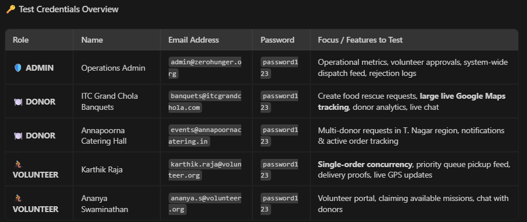

# No Food Waste — Food Rescue & Redistribution Platform
> A Tech for Social Good platform bridging surplus food from weddings, restaurants, and institutions to hunger relief centers in the golden hour.

---

## 📁 Repository Structure

```
ZeroHunger-cfg-mock/
├── docs/                                           # Official Specifications & PDF Briefs
│   ├── 01_No_Food_Waste_Code_For_Good_Brief.pdf
│   ├── 01_No_Food_Waste_Code_For_Good_Brief.md
│   ├── 02_Technical_Requirements_Document.pdf
│   ├── 02_Technical_Requirements_Document.md
│   ├── 03_Product_Functional_Requirements_Document.pdf
│   ├── 03_Product_Functional_Requirements_Document.md
│   └── generate_pdfs.py                            # PDF generation script
├── frontend/                                       # End-to-End React + Vite Web Application
│   ├── src/
│   │   ├── components/                             # Header, Maps, Modals, Chat
│   │   ├── context/                                # Auth & Request Providers
│   │   ├── services/                               # Priority Engine & Mock Data Store
│   │   └── views/                                  # Donor, Volunteer & Admin Portals
│   ├── package.json
│   ├── vite.config.js
│   └── index.html
└── README.md
```

---

## 🚀 Running the Frontend

Navigate into the `frontend` folder and start the development server:

```bash
cd frontend
npm install
npm run dev
```

Once running, open your browser at the local Vite URL (default: `http://localhost:5173/`).

---

## 🌟 Key Features

1. **Role Switcher**: Seamlessly switch between **Donor**, **Volunteer**, and **Admin** personas directly from the top navigation bar.
2. **Geospatial Map Engine**: Powered by Leaflet/MapLibre, visualizing real-time surplus pickup locations, live volunteer pins, and hunger/need density hotspots.
3. **Distance & Quantity Priority Engine**: Implements the normalized formula $\text{Priority} = (w_{\text{dist}} \times \text{DistScore}) + (w_{\text{qty}} \times \text{QtyScore})$.
4. **Donor Portal**: Surplus food broadcasts with golden-hour countdowns, status tracking, and impact metrics.
5. **Volunteer Portal**: Available food rescue radar, atomic task claiming, active mission stepper, and delivery proof uploads (photos + GPS).
6. **Admin Command Center**: State analytics, hunger hotspot clustering, volunteer approval queue, and priority engine tuning.
